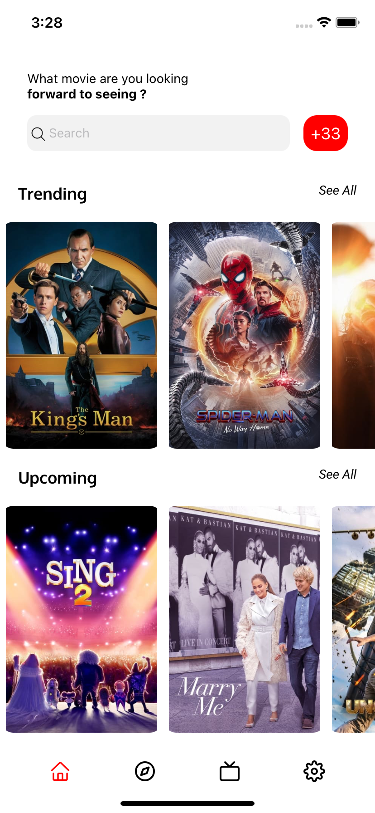
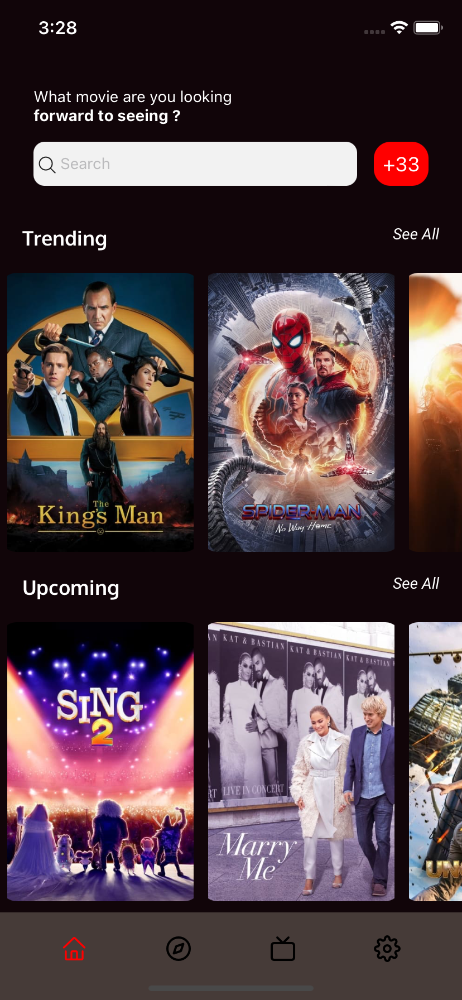
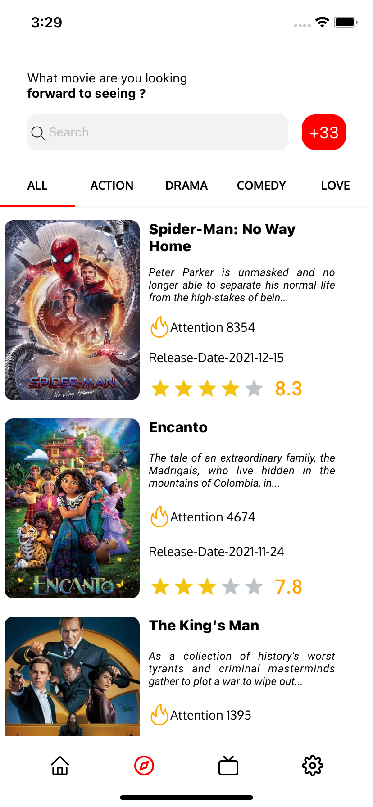
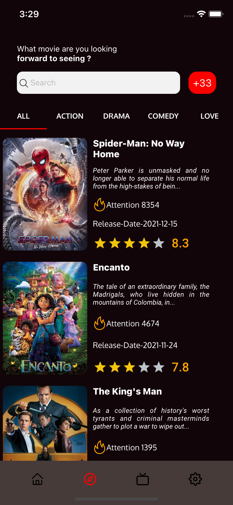
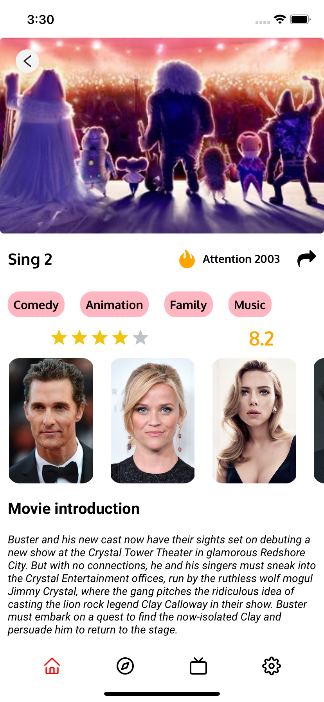
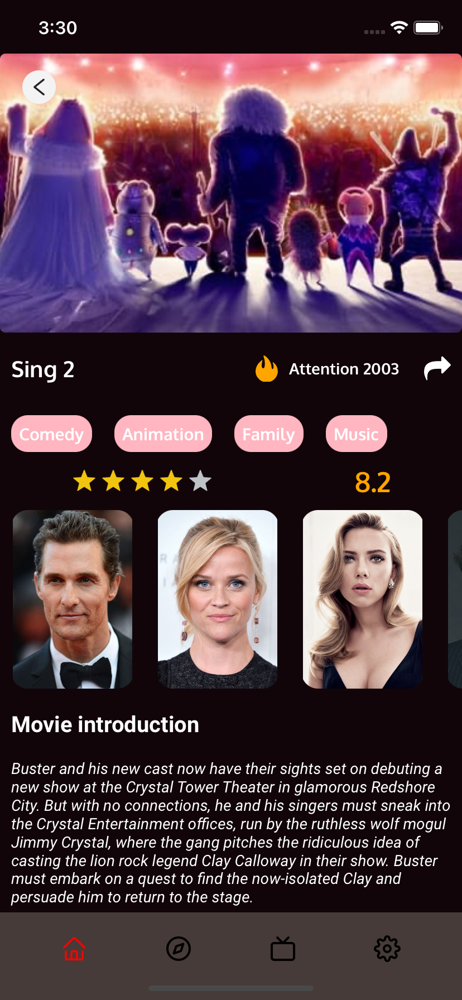
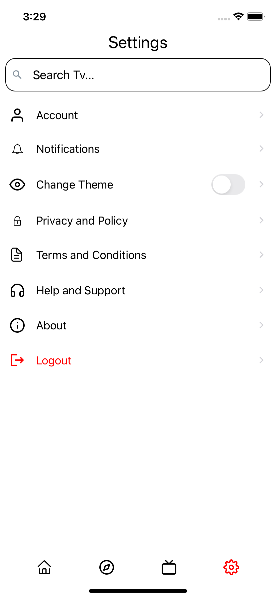

# Moviemania

<table>
  <tr>
    <td>Home-Light</td>
     <td>Home-Dark</td>
  </tr>
  <tr>
    <td valign="top"></td>
    <td valign="top"></td>
  </tr>
   <tr>
    <td>Explore-Light</td>
     <td>Explore-Dark</td>
  </tr>
  <tr>
    <td valign="top"></td>
    <td valign="top"></td>
  </tr>
   <tr>
    <td>Detail-Light</td>
     <td>Detail-Dark</td>
  </tr>
  <tr>
    <td valign="top"></td>
    <td valign="top"></td>
  </tr>
   <tr>
    <td>Tv-Light</td>
     <td>Tv-Dark</td>
  </tr>
  <tr>
    <td valign="top"></td>
    <td valign="top"></td>
  </tr>
   <tr>
    <td>Setting-Light</td>
     <td>Setting-Dark</td>
  </tr>
  <tr>
    <td valign="top"></td>
    <td valign="top"></td>
  </tr>
 </table>
